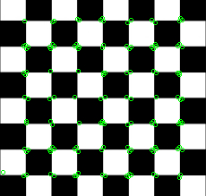

# Harris Corner Example


```c++
    qlm::Timer<qlm::msec> t{};
    std::string file_name = "input.png";
    // load the image
    qlm::Image<qlm::ImageFormat::RGB, uint8_t> in;
    if (!in.LoadFromFile(file_name))
    {
        std::cout << "Failed to read the image\n";
        return -1;
    }
    // check alpha component
    bool alpha{ true };
    if (in.NumerOfChannels() == 3)
        alpha = false;

    auto gray = qlm::ColorConvert< qlm::ImageFormat::RGB, uint8_t, qlm::ImageFormat::GRAY, uint8_t>(in);

    unsigned int filter_size = 3;
    unsigned int block_size = 3;
    float k = 0.22;
    float threshold = 0.0000001;

    // do the operation
    t.start();
    auto out = qlm::HarrisCorner(gray, block_size, filter_size, k, threshold);
    t.end();

    t.show();

    // draw corners
    qlm::Circle<int> circle = { .radius = 2 };
    qlm::Pixel <qlm::ImageFormat::RGB, uint8_t> green{ 0, 255, 0 };

    for (auto& i : out)
    {
        circle.center = i.point;
        in = qlm::DrawCircle(in, circle, green);
    }


    if (!in.SaveToFile("result.jpg", alpha))
    {
        std::cout << "Failed to write \n";
    }
```

### The input

### The output


Time = 11 ms

