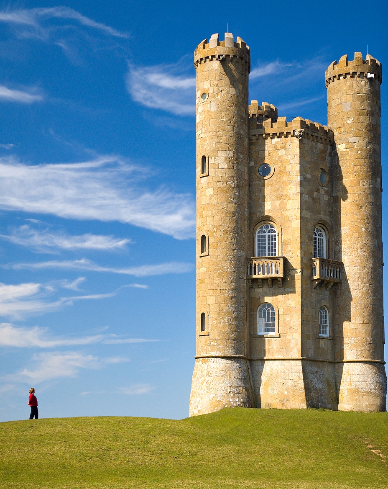

# Seam Carving Example

```c++
    qlm::Timer<qlm::msec> t{};
    std::string file_name = "input.jpg"; 
    // load the input image
    qlm::Image<qlm::ImageFormat::RGB, uint8_t> in;
    if (!in.LoadFromFile(file_name))
    {
        std::cout << "Failed to read the image\n";
        return -1;
    }
    // check alpha component
    bool alpha{ true };
    if (in.NumerOfChannels() == 3)
        alpha = false;

    const size_t target_width = in.width - 500;
    const size_t target_height =  in.height + 200;

    const qlm::EnergyFlag energy = qlm::EnergyFlag::BACKWARD;
    const qlm::OrderFlag order = qlm::OrderFlag::WIDTH_FIRST;

    t.start();
    auto out = qlm::SeamCarving(in, target_width, target_height, energy, order);
    t.end();

    t.show();

    if (!out.SaveToFile("result.jpg", alpha))
    {
        std::cout << "Failed to write \n";
    }
```
### The input

### The output


Time = 125519 ms

