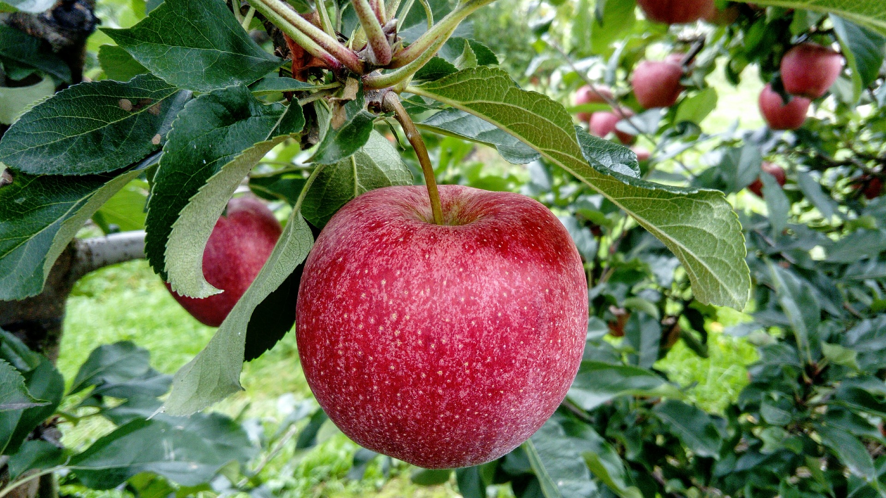
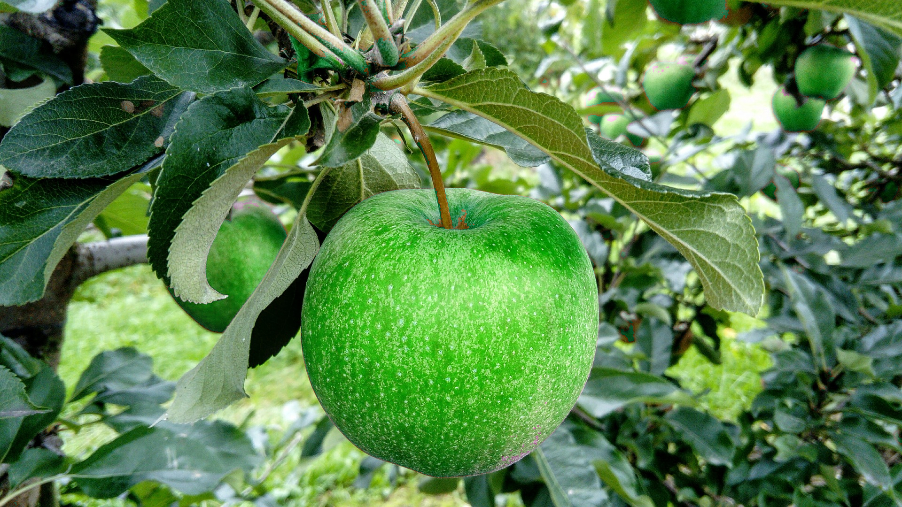

# Color Convert

## Description
The function converts an input image of format `src_frmt` with pixel type `src_t` to 
an output image of format `dst_frmt` with pixel type `dst_t`.

You can check the implementation [here](../../../../source/ColorConvert.cpp).

## C++ API
```c++
namespace qlm
{
	template<ImageFormat src_frmt, pixel_t src_t, ImageFormat dst_frmt, pixel_t dst_t>
	Image<dst_frmt, dst_t> ColorConvert(const Image<src_frmt, src_t>& in);
}
```

## Supported Conversions

- GRAY to RGB
- RGB to GRAY
- YCrCb to RGB
- RGB to YCrCb
- HSV to RGB
- RGB to HSV
- HLS to RGB
- RGB to HSL

## Parameters

| Name       | Type           | Description                      |
|------------|----------------|----------------------------------|
| `src_frmt` | `ImageFormat`  | The input image format.          |
| `src_t`    | `pixel_t`      | The input image type.            |
| `dst_frmt` | `ImageFormat`  | The output image format.         |
| `dst_t`    | `pixel_t`      | The output image type.           |
| `in`       | `Image`        | The input image.                 |

## Return Value
The function returns an image of type `Image<dst_frmt, dst_t>`.

## Example

```c++
   qlm::Timer<qlm::msec> t{};
	std::string file_name = "input.jpg";
	// load the image
	qlm::Image<qlm::ImageFormat::RGB, uint8_t> in;
	if (!in.LoadFromFile(file_name))
	{
		std::cout << "Failed to read the image\n";
		return -1;
	}
	// check alpha component
	bool alpha{ true };
	if (in.NumerOfChannels() == 3)
		alpha = false;

	// RGB to HSV
	t.start();
	auto out = qlm::ColorConvert<qlm::ImageFormat::RGB, uint8_t, 
								 qlm::ImageFormat::HSV, uint8_t>(in);
	t.end();
	
	t.show();

	// red to green
	for (int i = 0; i < out.height * out.width; i++)
	{
		auto pix = out.GetPixel(i);
		// extract H value
		int h = (int)pix.h * 2 ;
		// shift the red color by 120 to make green
		if ((h >= 0 && h <= 30) || h >= 330)
		{
			h += 120;
		}
		// ensure the range 0-360
		if (h > 360)
		{
			h -= 360;
		}
		// to fit in 8-bits
		h /= 2;
		pix.h = h;

		out.SetPixel(i, pix);
	}
	// HSV2RGB
	auto out2 = qlm::ColorConvert<qlm::ImageFormat::HSV, uint8_t,
								  qlm::ImageFormat::RGB, uint8_t>(out);
	if (!out2.SaveToFile("result.jpg", alpha))
	{
		std::cout << "Failed to write \n";
	}
```
### The input

### The output


Time = 24 ms
