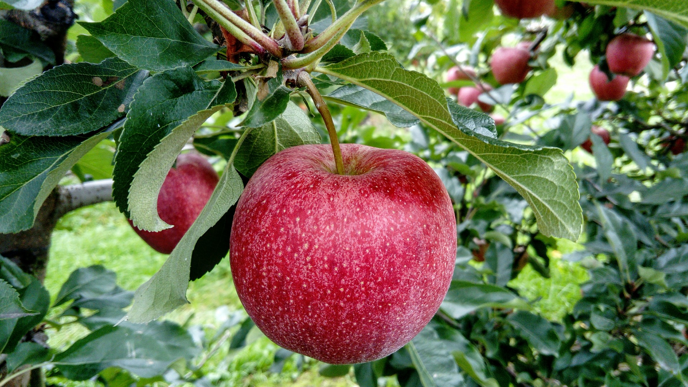
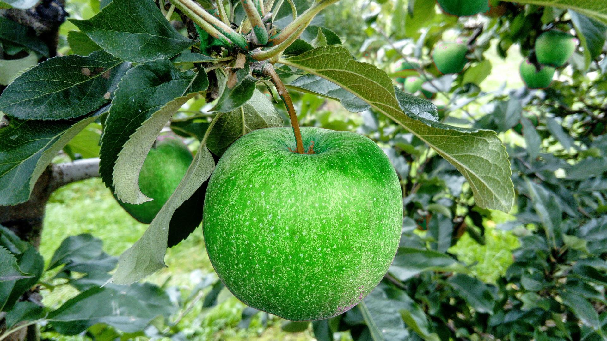

# Color Convert

## Description
The function converts an input image of format `src_frmt` with pixel type `src_t` to 
an output image of format `dst_frmt` with pixel type `dst_t`.

You can check the implementation [here](../../../../source/ColorConvert.cpp).

## C++ API
```c++
namespace qlm
{
	template<ImageFormat dst_frmt, ImageFormat src_frmt, pixel_t T>
	Image<dst_frmt, T> ColorConvert(const Image<src_frmt, T>& in);
}
```

`src_frmt` and `T` are deduced from the input image, so only the destination format
has to be given explicitly (e.g. `qlm::ColorConvert<qlm::ImageFormat::HSV>(in)`).
If `dst_frmt == src_frmt` the input is returned as-is (copy).

## Supported Conversions

- GRAY to RGB
- RGB to GRAY
- YCrCb to RGB
- RGB to YCrCb
- HSV to RGB
- RGB to HSV
- HLS to RGB
- RGB to HLS

## How the conversion is done

The formulas are the same as OpenCV's `cvtColor` — see
[Color conversions](https://docs.opencv.org/3.4.20/de/d25/imgproc_color_conversions.html).

| Conversion | Formula |
|---|---|
| RGB → GRAY | `Y = 0.299·R + 0.587·G + 0.114·B` |
| GRAY → RGB | `R = G = B = v` |
| RGB → YCrCb | `Y = 0.299·R + 0.587·G + 0.114·B`, `Cr = (R − Y)·0.713 + δ`, `Cb = (B − Y)·0.564 + δ` |
| YCrCb → RGB | `R = Y + 1.402·(Cr − δ)`, `G = Y − 0.714·(Cr − δ) − 0.344·(Cb − δ)`, `B = Y + 1.772·(Cb − δ)` |
| RGB → HSV | `V = max(R,G,B)`, `S = Δ / max`, `H` from the dominant channel (`Δ = max − min`) |
| RGB → HLS | `L = (max + min) / 2`, `S = Δ / (1 − \|2L − 1\|)`, same `H` |
| HSV/HLS → RGB | chroma `C = V·S` (HSV) or `C = (1 − \|2L − 1\|)·S` (HLS), `m = V − C` (HSV) or `m = L − C/2` (HLS), then the standard `H` sextant lookup `(R', G', B') + m` |

`δ` is the mid-range of the pixel type (`128` for `uint8_t`, `0.5` for `float`).
All channel results are clamped to the output type range (like OpenCV's `saturate_cast`).

## Notes

- Only `uint8_t` images are currently instantiated.
- For 8-bit output, the hue component of HSV/HLS is stored as `H / 2` (so `H ∈ [0, 360)` fits in one byte as `[0, 180)`), the same convention OpenCV uses.
- Pure gray pixels (R = G = B) get `H = 0` and black pixels get `S = 0` (mathematically undefined, defined here to avoid 0/0).
- A full 8-bit round trip (e.g. RGB → HSV → RGB) is not bit-exact: `H` is quantized to `H/2` and each channel is quantized independently, so errors of a few units are expected (same as OpenCV).

## Parameters

| Name       | Type           | Description                      |
|------------|----------------|----------------------------------|
| `src_frmt` | `ImageFormat`  | The input image format.          |
| `src_t`    | `pixel_t`      | The input image type.            |
| `dst_frmt` | `ImageFormat`  | The output image format.         |
| `dst_t`    | `pixel_t`      | The output image type.           |
| `in`       | `Image`        | The input image.                 |

## Return Value
The function returns an image of type `Image<dst_frmt, dst_t>`.

## Example

```c++
   qlm::Timer<qlm::msec> t{};
	std::string file_name = "input.jpg";
	// load the image
	qlm::Image<qlm::ImageFormat::RGB, uint8_t> in;
	if (!in.LoadFromFile(file_name))
	{
		std::cout << "Failed to read the image\n";
		return -1;
	}
	// check alpha component
	bool alpha{ true };
	if (in.NumerOfChannels() == 3)
		alpha = false;

	// RGB to HSV
	t.Start();
	auto out = qlm::ColorConvert<qlm::ImageFormat::HSV>(in);
	t.End();
	
	std::cout <<"Time = " << t.ElapsedString() << "\n";

	// red to green
	for (int i = 0; i < out.height * out.width; i++)
	{
		auto pix = out.GetPixel(i);
		// extract H value
		int h = (int)pix.h * 2 ;
		// shift the red color by 120 to make green
		if ((h >= 0 && h <= 30) || h >= 330)
		{
			h += 120;
		}
		// ensure the range 0-360
		if (h > 360)
		{
			h -= 360;
		}
		// to fit in 8-bits
		h /= 2;
		pix.h = h;

		out.SetPixel(i, pix);
	}
	// HSV2RGB
	auto out2 = qlm::ColorConvert<qlm::ImageFormat::RGB>(out);
	if (!out2.SaveToFile("result.jpg", alpha))
	{
		std::cout << "Failed to write \n";
	}
```
### The input

### The output


Time = 33 ms
