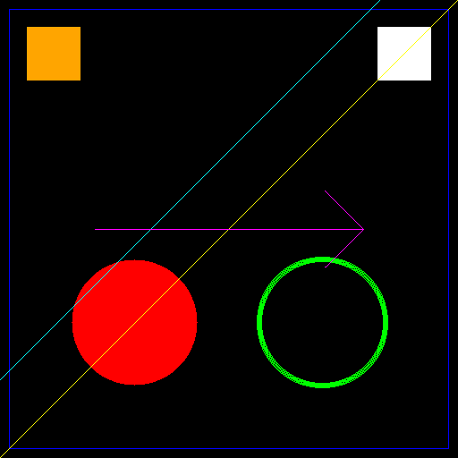

# Drawing Functions

All drawing functions take an input image, draw on a **copy** of it, and return the result. The input image is never modified.

## DrawCircle
Draws a circle outline, or a filled disk when `thickness < 0`.
```c++
template<ImageFormat frmt, pixel_t T, pixel_t T2>
Image<frmt, T> DrawCircle(const Image<frmt, T>& in,
                          const Circle<T2>& circle,
                          const Pixel<frmt, T>& color,
                          int thickness = 1);
```

| Name        | Type        | Description                                                    |
|-------------|-------------|----------------------------------------------------------------|
| `in`        | `Image`     | The input image.                                               |
| `circle`    | `Circle<T2>`| `{center, radius}` of the circle.                              |
| `color`     | `Pixel`     | The drawing color.                                             |
| `thickness` | `int`       | Line thickness; `thickness < 0` draws a filled disk, `0` draws nothing. |

## DrawLine
Draws a line segment between two points (inclusive endpoints).
```c++
template<ImageFormat frmt, pixel_t T>
Image<frmt, T> DrawLine(const Image<frmt, T>& in, const Line& line, const Pixel<frmt, T>& c);
```

| Name   | Type    | Description                          |
|--------|---------|--------------------------------------|
| `in`   | `Image` | The input image.                     |
| `line` | `Line`  | `{x0, y0, x1, y1}` endpoints.        |
| `c`    | `Pixel` | The drawing color.                   |

### DrawLine (polar overload)
Draws the line `rho * cos(theta) + ...` defined by a radius and an angle (normal form, as produced by `HoughLines`).
```c++
template<ImageFormat frmt, pixel_t T>
Image<frmt, T> DrawLine(const Image<frmt, T>& in, const LinePolar& line, const Pixel<frmt, T>& color);
```

| Name   | Type        | Description                                  |
|--------|-------------|----------------------------------------------|
| `in`   | `Image`     | The input image.                             |
| `line` | `LinePolar` | `{radius, angle}` (angle in radians).        |
| `color`| `Pixel`     | The drawing color.                           |

## DrawArrowedLine
Draws a line with an arrow head at the end point.
```c++
template<ImageFormat frmt, pixel_t T>
Image<frmt, T> DrawArrowedLine(const Image<frmt, T>& in, const Line& line, const Pixel<frmt, T>& c, double tipLength = 0.1);
```

| Name        | Type     | Description                                                       |
|-------------|----------|-------------------------------------------------------------------|
| `in`        | `Image`  | The input image.                                                  |
| `line`      | `Line`   | `{x0, y0, x1, y1}`; the arrow head is placed at `(x1, y1)`.       |
| `c`         | `Pixel`  | The drawing color.                                                |
| `tipLength` | `double` | Arrow head length as a fraction of the line length. Default `0.1`. |

## DrawRectangle
Draws a rectangle outline.
```c++
template<ImageFormat frmt, pixel_t T>
Image<frmt, T> DrawRectangle(const Image<frmt, T>& in, const Rectangle<int>& rec, const Pixel<frmt, T>& c);
```

| Name   | Type             | Description                                        |
|--------|------------------|----------------------------------------------------|
| `in`   | `Image`          | The input image.                                   |
| `rec`  | `Rectangle<int>` | `{top_left, width, height}` of the rectangle.      |
| `c`    | `Pixel`          | The drawing color.                                 |

## DrawCluster
Colors the pixels of each cluster (as produced by `KMeans`).
```c++
template<ImageFormat frmt, pixel_t T>
Image<frmt, T> DrawCluster(const Image<frmt, T>& in, const std::vector<Cluster<frmt, T>>& clusters);
```

| Name       | Type                       | Description                                         |
|------------|----------------------------|-----------------------------------------------------|
| `in`       | `Image`                    | The input image (only its dimensions are used).     |
| `clusters` | `vector<Cluster<frmt, T>>` | Clusters, each with a pixel list and a color.       |

## Example

```c++
    using RGB8 = qlm::Pixel<qlm::ImageFormat::RGB, uint8_t>;

    // blank canvas
    qlm::Image<qlm::ImageFormat::RGB, uint8_t> canvas;
    canvas.Create(512, 512, RGB8(0, 0, 0));

    const RGB8 red(255, 0, 0);
    const RGB8 green(0, 255, 0);
    const RGB8 blue(0, 0, 255);
    const RGB8 yellow(255, 255, 0);
    const RGB8 cyan(0, 255, 255);
    const RGB8 magenta(255, 0, 255);
    const RGB8 orange(255, 165, 0);
    const RGB8 white(255, 255, 255);

    // DrawCluster (paints on a fresh canvas, so apply it first):
    //    two solid 60x60 blocks that survive under the later drawings
    std::vector<qlm::Cluster<qlm::ImageFormat::RGB, uint8_t>> clusters(2);
    clusters[0].color = orange;
    clusters[1].color = white;
    for (int y = 0; y < 60; y++)
    {
        for (int x = 0; x < 60; x++)
        {
            clusters[0].pixels.push_back(qlm::Point<int>{30 + x, 30 + y});
            clusters[1].pixels.push_back(qlm::Point<int>{422 + x, 30 + y});
        }
    }
    auto out = qlm::DrawCluster(canvas, clusters);

    // filled circle
    out = qlm::DrawCircle(out, qlm::Circle<int>{qlm::Point<int>{150, 360}, 70.0f}, red, -1);
    // circle outline
    out = qlm::DrawCircle(out, qlm::Circle<int>{qlm::Point<int>{360, 360}, 70.0f}, green, 6);
    // rectangle outline
    out = qlm::DrawRectangle(out, qlm::Rectangle<int>{qlm::Point<int>{10, 10}, 491, 491}, blue);
    // plain line
    out = qlm::DrawLine(out, qlm::Line{0, 511, 511, 0}, yellow);
    // polar line
    out = qlm::DrawLine(out, qlm::LinePolar{300.0f, 0.7853982f}, cyan);
    // arrowed line
    out = qlm::DrawArrowedLine(out, qlm::Line{106, 256, 406, 256}, magenta, 0.2);

    out.SaveToFile("result.png");
```

### The output
Red = filled circle, green = circle outline, blue = rectangle,
yellow = plain line, cyan = polar line, magenta = arrowed line,
orange/white squares = clusters.

