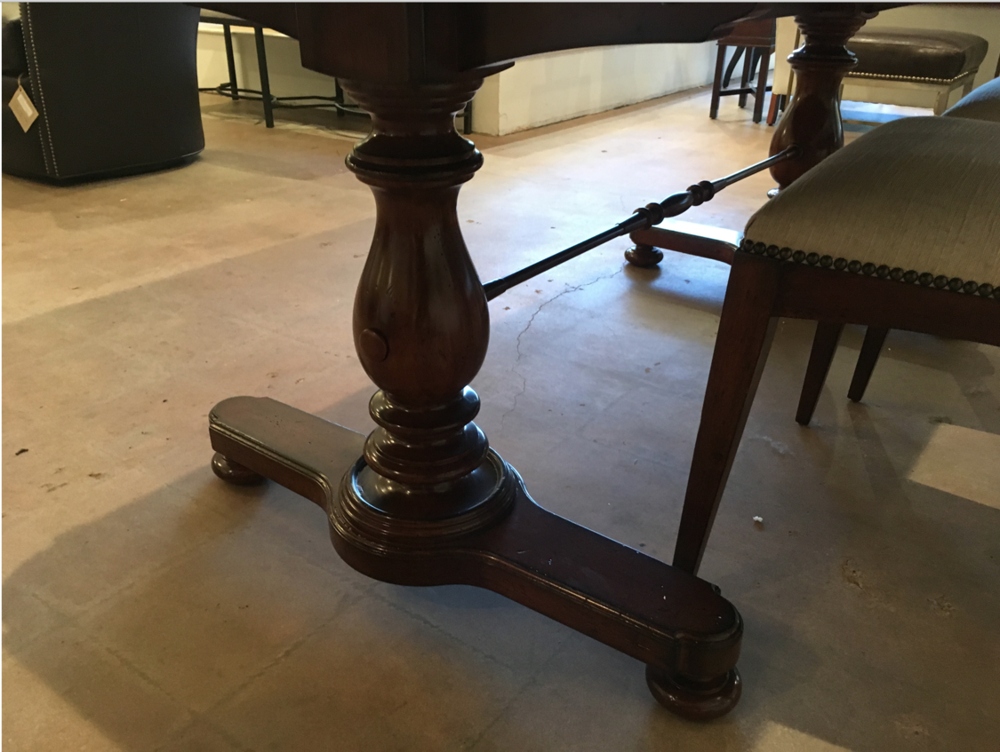
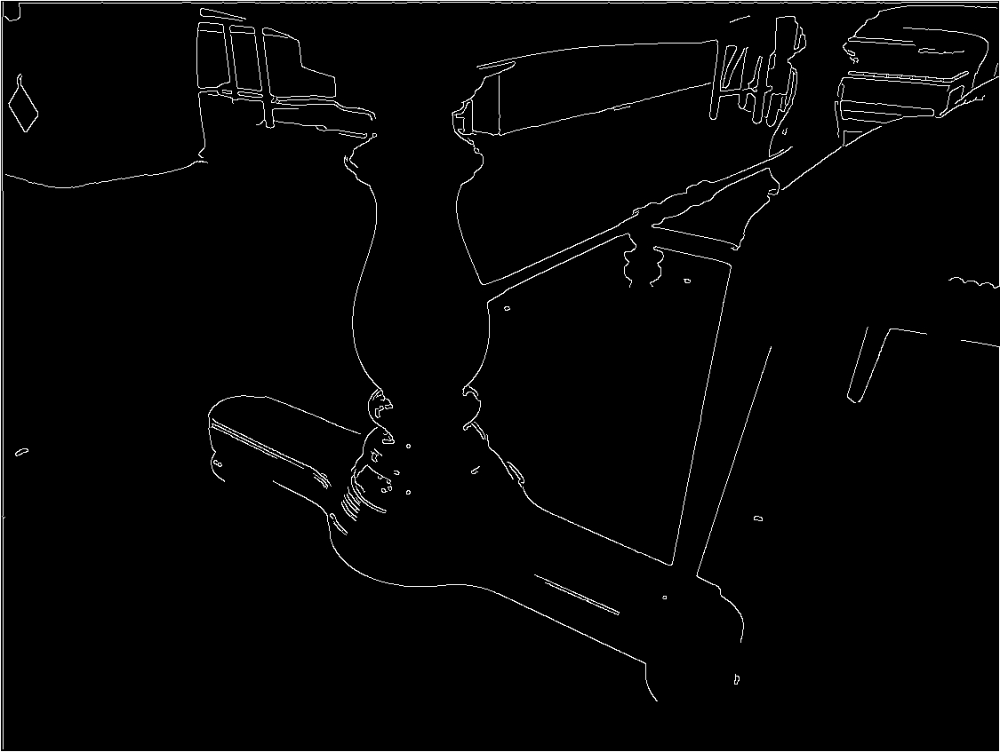

# Canny

## Description
Detects edges in a grayscale image using the Canny edge detector algorithm.

You can check the implementation [here](../../../../source/Canny.cpp)

## C++ API
```c++
namespace qlm
{
template<pixel_t T>
Image<ImageFormat::GRAY, T> Canny(
    const Image<ImageFormat::GRAY, T>& in,
    const int threshold_low,
    const int threshold_high,
    const int filter_size = 3,
    const bool l2_gradient = false,
    const BorderMode<ImageFormat::GRAY, T>& border_mode = BorderMode<ImageFormat::GRAY, T>{}
);
}
```

## Parameters

| Name              | Type          | Description                                                                                              |
|-------------------|---------------|----------------------------------------------------------------------------------------------------------|
| `in`              | `Image`       | The input grayscale image.                                                                               |
| `threshold_low`   | `int`         | Lower threshold for the hysteresis edge tracking phase.                                                  |
| `threshold_high`  | `int`         | Upper threshold for identifying strong edge pixels.                                                      |
| `filter_size`     | `int`         | Aperture size for the Sobel operator. Must be odd and greater than or equal to 3.                        |
| `l2_gradient`     | `bool`        | If true, use the more accurate L2 norm for gradient magnitude; otherwise use the L1 norm.                |
| `border_mode`     | `BorderMode`  | The border extrapolation method used during Sobel filtering.                                             |

## Return Value
The function returns a single-channel grayscale image containing detected edges.

## Example

```c++
    std::cout << "start example\n";

    qlm::Timer<qlm::msec> t{};
    std::string file_name = "input.png";

    // Load the image
    qlm::Image<qlm::ImageFormat::RGB, uint8_t> in;
    if (!in.LoadFromFile(file_name))
    {
        std::cout << "Failed to read the image\n";
        return -1;
    }

    // Check alpha component
    bool alpha{ true };
    if (in.NumerOfChannels() == 1)
        alpha = false;

    // convert to grayscale
    auto gray = qlm::ColorConvert< qlm::ImageFormat::RGB, uint8_t, qlm::ImageFormat::GRAY, uint8_t>(in);

    // apply gaussian blur
    const int filter_size = 5;
    const float sigma = 1.4f;
    auto blurred = qlm::Gaussian(gray, filter_size, sigma);

    // Call Canny edge detection
    const int threshold_low = 50;
    const int threshold_high = 140;
    const int sobel_size = 3;
	const bool l2_gradient = true;

    t.Start();
    auto result = qlm::Canny(blurred, threshold_low, threshold_high, sobel_size, l2_gradient);
    t.End();

    std::cout << "Time = " << t.ElapsedString() << "\n";

    if (!result.SaveToFile("result.jpg", alpha))
    {
        std::cout << "Failed to write \n";
    }
```

### The input

### The output


Time = 109 ms
