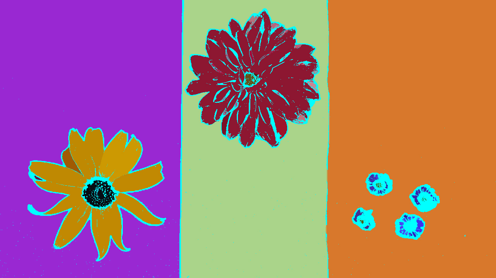

# DBSCAN Clustering Algorithm

## Description
Performs clustering using the DBSCAN (Density-Based Spatial Clustering of Applications with Noise) algorithm.

You can check the implementation [here](../../../../source/DBSCAN.cpp)

## C++ API
```c++
namespace qlm
{
    template<ImageFormat frmt, pixel_t T>
    DBSCANResult DBSCAN(
        const Image<frmt, T>& in,
        const int eps,
        const int min_pts);
}


## Parameters

| Name           | Type    | Description                                                                                                            |
|----------------|---------|------------------------------------------------------------------------------------------------------------------------|
| `in`           | `Image` | The input image.                                                                                                       |
| `eps`          | `int`   | The maximum distance between two samples for one to be considered as in the neighborhood of the other.                 |
| `min_pts`      | `int`   | The number of samples in a neighborhood for a point to be considered as a core point. This includes the point itself.  |


## Return Value
The function returns a vector of clusters of type `DBSCANResult`.
```c++
namespace qlm
{
    struct DBSCANResult
    {
        Image<ImageFormat::GRAY, int> labels;
        int num_clusters;
        bool noise_exists;
    };
}
```

## Example

```c++
    qlm::Timer<qlm::msec> t{};
    std::string file_name = "input.jpg"; 

    // Load the image
    qlm::Image<qlm::ImageFormat::RGB, uint8_t> in;
    if (!in.LoadFromFile(file_name))
    {
        std::cout << "Failed to read the image\n";
        return -1;
    }

    // Check alpha component
    bool alpha{ true };
    if (in.NumerOfChannels() == 1)
        alpha = false;

    const int eps = 10;
    const int min_pts = 20;

    // Perform DBSCAN
    t.Start();
    auto result = qlm::DBSCAN(in, eps, min_pts);
    t.End();

    std::cout << "Time = " << t.ElapsedString() << "\n";

    // Check if num_clusters is valid
    if (result.num_clusters <= 0)
    {
        std::cout << "No clusters found or invalid number of clusters.\n";
        return -1;
    }

    std::cout << "Number of clusters: " << result.num_clusters << "\n";
    std::cout << "Noise exists: " << (result.noise_exists ? "Yes, and marked as Cyan" : "No") << "\n";

    // Construct clusters
    const int num_clusters = result.num_clusters + 1;

    std::vector<qlm::Cluster<qlm::ImageFormat::RGB, uint8_t>> clusters(num_clusters);
    std::vector<qlm::Pixel<qlm::ImageFormat::RGB, float>> pix_avg (num_clusters);

    for (int y = 0; y < in.height; ++y)
    {
        for (int x = 0; x < in.width; ++x)
        {
            const int label = result.labels.GetPixel(x, y).v;
            clusters[label + 1].pixels.push_back({ x, y });
            pix_avg[label + 1] = pix_avg[label + 1] + in.GetPixel(x, y);
        }
    }
    // Compute average pixel for each cluster
    for (int i = 1; i < num_clusters; ++i)
    {
        clusters[i].color = pix_avg[i] / clusters[i].pixels.size();
    }
    // mark noise pixels as Cyan
    clusters[0].color = {0, 255, 255};

    // draw clusters
    auto out = qlm::DrawCluster(in, clusters);

    if (!out.SaveToFile("result.jpg", alpha))
    {
        std::cout << "Failed to write \n";
    }
```

### The input

### The output


Time = 220525 msec