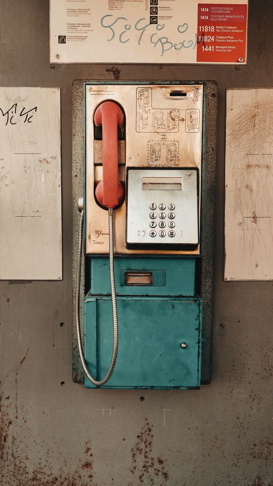

# GoodFeaturesToTrack

## Description
Detects strong corners using the Good Features to Track (Shi-Tomasi) algorithm.

You can check the implementation [here](../../../../source/GoodFeaturesToTrack.cpp)

## C++ API
```c++
namespace qlm
{
    template<pixel_t T = uint8_t>
    std::vector<KeyPoint<int>> GoodFeaturesToTrack(
        const Image<ImageFormat::GRAY, T>& in,
        const int max_corners,
        const double quality_level,
        const double min_distance,
        const int block_size = 3,
        const int gradient_size = 3,
        const bool use_harris_detector = false,
        const double k = 0.04,
        const BorderMode<ImageFormat::GRAY, T>& border_mode = BorderMode<ImageFormat::GRAY, T>{}
    );
}
```

## Parameters

| Name                 | Type            | Description                                                                                              |
|----------------------|-----------------|----------------------------------------------------------------------------------------------------------|
| `in`                 | `Image`         | The input grayscale image.                                                                               |
| `max_corners`        | `int`           | Maximum number of strongest corners to return.                                                           |
| `quality_level`      | `double`        | Minimum accepted quality of corners, relative to the strongest corner response.                          |
| `min_distance`       | `double`        | Minimum Euclidean distance between returned corners.                                                     |
| `block_size`         | `int`           | Neighborhood size used to compute sums of derivatives.                                                   |
| `gradient_size`      | `int`           | Aperture size for the Sobel derivative used in gradient computation.                                     |
| `use_harris_detector`| `bool`          | If true, use the Harris detector formula; otherwise use the Shi-Tomasi corner response.                  |
| `k`                  | `double`        | Free parameter for the Harris detector. Ignored when `use_harris_detector` is false.                     |
| `border_mode`        | `BorderMode`    | Pixel extrapolation method used for derivative filtering.                                                |

## Return Value
The function returns a vector of key-points(corners) of type `std::vector<KeyPoint<int>>`.

## Example

```c++
    qlm::Timer<qlm::msec> t{};
    std::string file_name = "input.jpg";

    // Load the input image.
    qlm::Image<qlm::ImageFormat::RGB, uint8_t> in;
    if (!in.LoadFromFile(file_name))
    {
        std::cout << "Failed to read the image\n";
        return -1;
    }

    // Check alpha component.
    bool alpha{ true };
    if (in.NumerOfChannels() == 3)
        alpha = false;

    // Convert the input image to grayscale.
    const auto gray = qlm::ColorConvert<qlm::ImageFormat::RGB, uint8_t, qlm::ImageFormat::GRAY, uint8_t>(in);

    // Detect corners with GoodFeaturesToTrack.
    const int max_corners = 200;
    const double quality_level = 0.01;
    const double min_distance = 10.0;
    const int blockSize = 3;
    const int gradientSize = 3;
    const bool useHarrisDetector = true;
    const double k = 0.04;

    t.Start();
    auto corners = qlm::GoodFeaturesToTrack(gray, max_corners, quality_level, min_distance, blockSize, gradientSize, useHarrisDetector, k);
    t.End();

    std::cout << "Found " << corners.size() << " corners\n";
    std::cout << "Time = " << t.ElapsedString() << "\n";

    // Draw the detected corners on the input image.
    qlm::Circle<int> circle{ .radius = 3 };
    qlm::Pixel<qlm::ImageFormat::RGB, uint8_t> color{255, 0, 255};

    for (const auto& corner : corners)
    {
        circle.center = corner.point;
        in = qlm::DrawCircle(in, circle, color);
    }

    if (!in.SaveToFile("result.jpg", alpha))
    {
        std::cout << "Failed to write \n";
    }
```

### The input

### The output


Time = 82 ms
