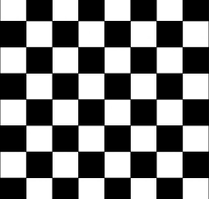
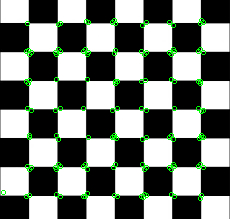

# Harris Corner

## Description
Harris corner detector

 You can check the implementation [here](../../../../source/HarrisCorner.cpp)

## C++ API
```c++
namespace qlm
{
	template<ImageFormat frmt, pixel_t T = uint8_t>
	std::vector<KeyPoint<int>> HarrisCorner(
		const Image<frmt, T>& in,
		const unsigned int block_size,
		const unsigned int filter_size,
		float k,
		float threshold,
		const BorderMode<frmt, T>& border_mode = BorderMode<frmt, T>{}
	)
}
```

## Parameters

| Name           | Type          | Description                                                                                  |
|----------------|---------------|----------------------------------------------------------------------------------------------|
| `in`           | `Image`       | The input image.                                                                             |
| `block_size`   | `unsigned int`| The neighborhood size.                                                                       |
| `filter_size`  | `unsigned int`| The aperture parameter for the Sobel operator.                                               |
| `k`            | `float`       | Harris detector free parameter.															   |
| `threshold`    | `float`       | The threshold parameter. Only those corners are returned that have response ( >threshold ).  |
| `border_mode`  | `BorderMode`  | The pixel extrapolation method.                                                              |

## Return Value
The function returns a vector of key-points(corners) of type `std::vector<KeyPoint<int>>`.

## Example

```c++
    qlm::Timer<qlm::msec> t{};
    std::string file_name = "input.png";
    // load the image
    qlm::Image<qlm::ImageFormat::RGB, uint8_t> in;
    if (!in.LoadFromFile(file_name))
    {
        std::cout << "Failed to read the image\n";
        return -1;
    }
    // check alpha component
    bool alpha{ true };
    if (in.NumerOfChannels() == 3)
        alpha = false;

    auto gray = qlm::ColorConvert< qlm::ImageFormat::RGB, uint8_t, qlm::ImageFormat::GRAY, uint8_t>(in);

    unsigned int filter_size = 3;
    unsigned int block_size = 3;
    float k = 0.22;
    float threshold = 0.0000001;

    // do the operation
    t.Start();
    auto out = qlm::HarrisCorner(gray, block_size, filter_size, k, threshold);
    t.End();

    std::cout <<"Time = " << t.ElapsedString() << "\n";

    // draw corners
    qlm::Circle<int> circle = { .radius = 2 };
    qlm::Pixel <qlm::ImageFormat::RGB, uint8_t> green{ 0, 255, 0 };

    for (auto& i : out)
    {
        circle.center = i.point;
        in = qlm::DrawCircle(in, circle, green);
    }


    if (!in.SaveToFile("result.jpg", alpha))
    {
        std::cout << "Failed to write \n";
    }
```

### The input

### The output


Time = 11 ms