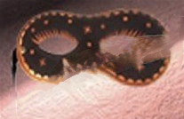
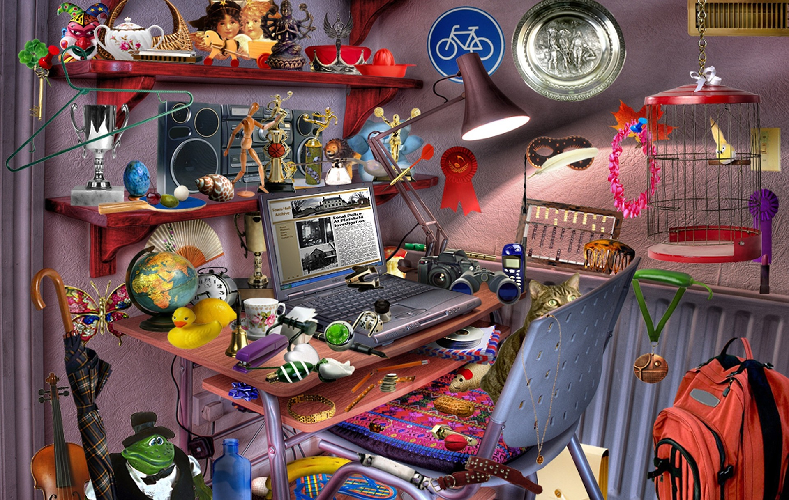

# Match Template

## Description
Template matching is a technique for finding areas of an image that match 
a given template image (a smaller image patch) using the specified method 
and stores the comparison results in result.

You can check the implementation [here](../../../../source/MatchTemplate.cpp)
## C++ API
```c++
namespace qlm
{
	template<ImageFormat frmt, pixel_t T>
	Image<ImageFormat::GRAY, float> MatchTemplate(
		const Image<frmt, T>& in,
		const Image<frmt, T>& templ,
		const TemplateMatchFlag mode,
		const Image<ImageFormat::GRAY, uint8_t>& mask);
}
```


## Parameters

| Name    | Type                | Description                                                                                        |
|---------|---------------------|---------------------------------------------------------------------------------------------------|
| `in`    | `Image`             | The input image.                                                                                   |
| `templ` | `Image`             | The template image (patch) to be matched within the input image.                      |
| `mode`  | `TemplateMatchFlag` | The method used for template matching.  |
| `mask`  | `Image`             | mask image to restrict matching to certain regions.                           |


```c++
namespace qlm
{
	enum class TemplateMatchFlag
	{
		SQDIFF,
		SQDIFF_NORMED,
		CCORR,
		CCORR_NORMED
	};
}
```

## Return Value
The function returns an Image<ImageFormat::GRAY, float>, 
where each pixel represents the degree of match (similarity)
between the template and the corresponding region in the input image.


## Example

```c++
    qlm::Timer<qlm::msec> t{};
    std::string file_name = "input.jpg";
    // load the input image
    qlm::Image<qlm::ImageFormat::RGB, uint8_t> in;
    if (!in.LoadFromFile(file_name))
    {
        std::cout << "Failed to read the input image\n";
        return -1;
    }

    // check alpha component
        bool alpha{ true };
        if (in.NumerOfChannels() == 1)
            alpha = false;

    std::string template_name = "template.jpg";
    // load the template image
    qlm::Image<qlm::ImageFormat::RGB, uint8_t> templ;
    if (!templ.LoadFromFile(template_name))
    {
        std::cout << "Failed to read the template image\n";
        return -1;
    }

    qlm::Image<qlm::ImageFormat::GRAY, uint8_t> mask{};
    mask.create(templ.width, templ.height, 1);

    t.Start();
    auto out = qlm::MatchTemplate(in, templ, qlm::TemplateMatchFlag::SQDIFF, mask);
    t.End();

    std::cout <<"Time = " << t.ElapsedString() << "\n";

    // find min/max locations
    auto [min_loc, max_loc] = qlm::MinMaxLoc(out);

    qlm::Pixel <qlm::ImageFormat::RGB, uint8_t> green{ 0, 255, 0 };
    qlm::Rectangle rec{ {0, 0}, templ.width, templ.height };

    for (auto &p : min_loc)
    {
        rec.top_left = p;
        in = qlm::DrawRectangle(in, rec, green);
    }

    if (!in.SaveToFile("result.jpg", alpha))
    {
        std::cout << "Failed to write \n";
    }
```

### The input

### The template

### The output


Time = 215240 ms
