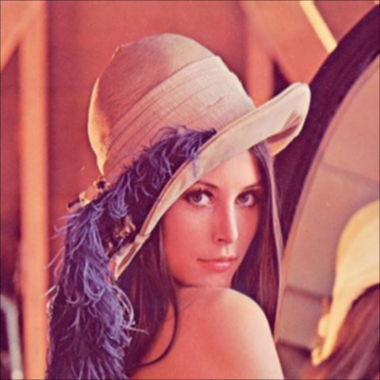
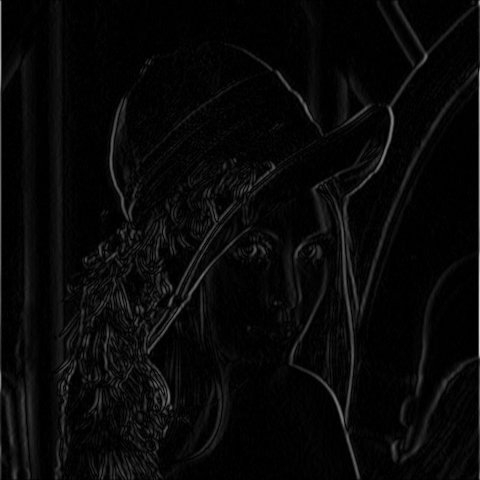
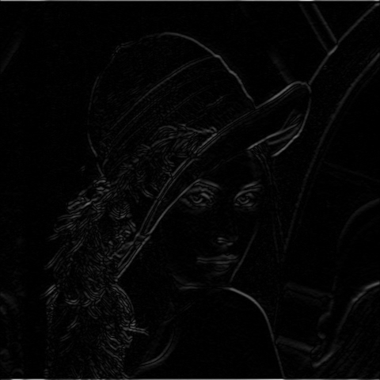
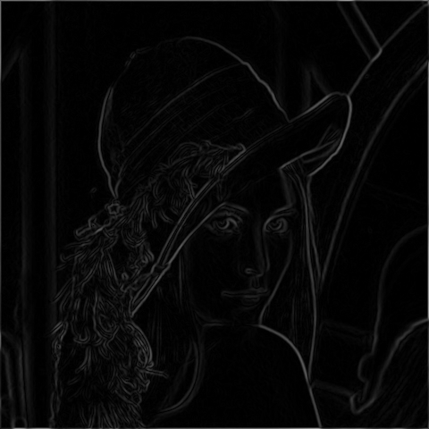

# Scharr

## Description
Applies the Scharr filter with size 3x3 on the input image. Scharr is an improved derivative
operator that yields better rotational symmetry than the Sobel operator.

You can check the implementation [here](../../../../source/Scharr.cpp)

The Scharr X kernel is:

```
     -3   0   3
     -10  0  10
     -3   0   3
```

which equals the separable product of the derivative kernel `[-1 0 1]` and the smoothing kernel `[3 10 3]`.

The Scharr Y kernel is:

```
     -3  -10  -3
      0    0   0
      3   10   3
```

## C++ API

### `ScharrX` Function
 Performs Scharr X derivative on the input image. input image must be in GRAY format

```c++
	template<pixel_t in_t, pixel_t out_t = int16_t>
	Image<ImageFormat::GRAY, out_t> ScharrX(
		const Image <ImageFormat::GRAY, in_t>& in,
		const BorderMode<ImageFormat::GRAY, in_t>& border_mode = BorderMode<ImageFormat::GRAY, in_t>{}
	);
```
### Parameters

| Name           | Type           | Description                                                                                  |
|----------------|----------------|----------------------------------------------------------------------------------------------|
| `in_t`         | `pixel_t`      | The data type of the input image.                                                            |
| `out_t`        | `pixel_t`      | The data type of the output image.                                                           |
| `in`           | `Image`        | The input image<GRAY, in_t>.                                                                 |
| `border_mode`  | `BorderMode` | The pixel extrapolation method.                                                              |

### Return Value
The function returns an image of type `Image<ImageFormat::GRAY, out_t>`.

### `ScharrY` Function
 Performs Scharr Y derivative on the input image. input image must be in GRAY format

```c++
	template<pixel_t in_t, pixel_t out_t = int16_t>
	Image<ImageFormat::GRAY, out_t> ScharrY(
		const Image<ImageFormat::GRAY, in_t>& in,
		const BorderMode<ImageFormat::GRAY, in_t>& border_mode = BorderMode<ImageFormat::GRAY, in_t>{}
	);
```
### Parameters

| Name           | Type           | Description                                                                                  |
|----------------|----------------|----------------------------------------------------------------------------------------------|
| `in_t`         | `pixel_t`      | The data type of the input image.                                                            |
| `out_t`        | `pixel_t`      | The data type of the output image.                                                           |
| `in`           | `Image`        | The input image<GRAY, in_t>.                                                                 |
| `border_mode`  | `BorderMode` | The pixel extrapolation method.                                                              |

### Return Value
The function returns an image of type `Image<ImageFormat::GRAY, out_t>`.
### `Scharr` Function
 Performs Scharr derivative on the input image. input image must be in GRAY format
 The return data type is `ScharrDerivatives`

```c++
   template<pixel_t in_t, pixel_t out_t = int16_t>
	ScharrDerivatives<in_t, out_t> Scharr(
		const Image<ImageFormat::GRAY, in_t>& in,
		const BorderMode<ImageFormat::GRAY, in_t>& border_mode = BorderMode<ImageFormat::GRAY, in_t>{}
	);
```
### Parameters

| Name           | Type           | Description                                                                                  |
|----------------|----------------|----------------------------------------------------------------------------------------------|
| `in_t`         | `pixel_t`      | The data type of the input image.                                                            |
| `out_t`        | `pixel_t`      | The data type of the output image.                                                           |
| `in`           | `Image`        | The input image<GRAY, in_t>.                                                                 |
| `border_mode`  | `BorderMode`   | The pixel extrapolation method.                                                              |

### Return Value
The function returns a structure of type `ScharrDerivatives<in_t, out_t>`.


### `ConvertScharrDepth` Function
 Change Bit Depth of scharr from S16 to U8

```c++
  Image<ImageFormat::GRAY, uint8_t> ConvertScharrDepth(Image < ImageFormat::GRAY, int16_t>& in);
```
### Parameters

| Name           | Type           | Description                                 |
|----------------|----------------|---------------------------------------------|
| `in`           | `Image`        | The input image<GRAY, int16_t>.             |

### Return Value
The function returns an image of type `Image<ImageFormat::GRAY, uint8_t>`.


## Example

```c++
    qlm::Timer<qlm::msec> t{};
	std::string file_name = "input.jpg";
	// load the image
	qlm::Image<qlm::ImageFormat::RGB, uint8_t> in;
	if (!in.LoadFromFile(file_name))
	{
		std::cout << "Failed to read the image\n";
		return -1;
	}
	// check alpha component
	bool alpha{ true };
	if (in.NumerOfChannels() == 3)
		alpha = false;

	// RGB to GRAY
	auto gray = qlm::ColorConvert<qlm::ImageFormat::RGB, uint8_t, qlm::ImageFormat::GRAY, uint8_t>(in);
	// do the operation
	t.Start();
	auto out = qlm::Scharr<uint8_t, int16_t>(gray);
	t.End();

	std::cout <<"Time = " << t.ElapsedString() << "\n";

	// S16 to U8
	auto x = qlm::ConvertScharrDepth(out.scharr_x);
	auto y = qlm::ConvertScharrDepth(out.scharr_y);

	if (!x.SaveToFile("resultx.jpg", alpha))
	{
		std::cout << "Failed to write \n";
	}

	if (!y.SaveToFile("resulty.jpg", alpha))
	{
		std::cout << "Failed to write \n";
	}

	if (!out.magnitude.SaveToFile("result.jpg", alpha))
	{
		std::cout << "Failed to write \n";
	}
```

### The input

### The output X

### The output Y

### The output
