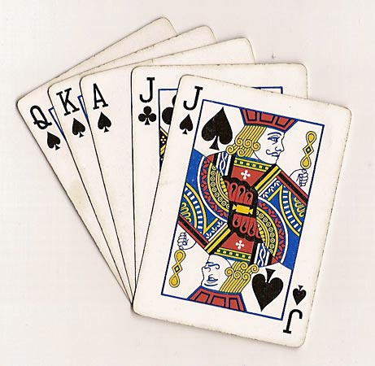
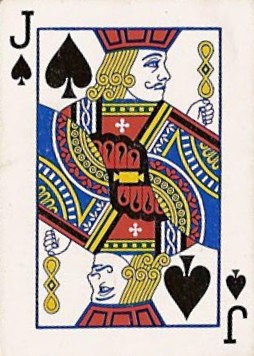

# Wrap Perspective

## Description
Applies a perspective transformation to an image.

The function warpPerspective transforms the source image using 3x3 transformation matrix:

You can check the implementation [here](../../../../source/WarpPerspective/WarpPerspective.cpp)

## C++ API
```c++
namespace qlm
{
	template<ImageFormat frmt, pixel_t T>
	Image<frmt, T> WarpPerspective(
		const Image<frmt, T>& in,
		const PerspectiveMatrix& mat,
		const int dst_width,
		const int dst_height,
		const InterpolationFlag inter,
		const BorderMode<frmt, T>& border_mode = BorderMode<frmt, T>{});
}
```

## Parameters

| Name         | Type                  | Description                      |
|--------------|-----------------------|----------------------------------|
| `in`         | `Image`               | The input image.                 |
| `mat`        | `PerspectiveMatrix`   | 3�3 transformation matrix.       |
| `dst_width`  | `int`                 | Output image width.              |
| `dst_height` | `int`                 | Output image height.             |
| `inter`      | `InterpolationFlag`   | The interpolation method.        |
| `border_mode`| `BorderMode`          | The pixel extrapolation method.  |

## Return Value
The function returns an image of type `Image<frmt, T>`.

## Example

```c++
    qlm::Timer<qlm::msec> t{};
    std::string file_name = "input.jpg";
    // load the image
    qlm::Image<qlm::ImageFormat::RGB, uint8_t> in;
    if (!in.LoadFromFile(file_name))
    {
        std::cout << "Failed to read the image\n";
        return -1;
    }
    // check alpha component
    bool alpha{ true };
    if (in.NumerOfChannels() == 3)
        alpha = false;

    const int dst_width = 254;
    const int dst_height = 356;

    const qlm::Point<int> src[4] =
    {
        {224, 93}, {430, 137}, {164, 378}, {370, 424}
    };

    const qlm::Point<int> dst[4] =
    {
        {0, 0}, {dst_width, 0}, {0, dst_height}, {dst_width, dst_height}
    };

    qlm::PerspectiveMatrix mat = qlm::GetPerspectiveTransform(src, dst);

    auto border_mode = qlm::BorderMode<qlm::ImageFormat::RGB, uint8_t>{};
    border_mode.border_type = qlm::BorderType::BORDER_REFLECT;

    // do the operation
    t.start();
    auto out = qlm::WarpPerspective(in, mat, dst_width, dst_height, qlm::InterpolationFlag::BILINEAR, border_mode);
    t.end();

    t.show();

    if (!out.SaveToFile("result.jpg", alpha))
    {
        std::cout << "Failed to write \n";
    }
```
### The input

### The output


Time = 14 ms