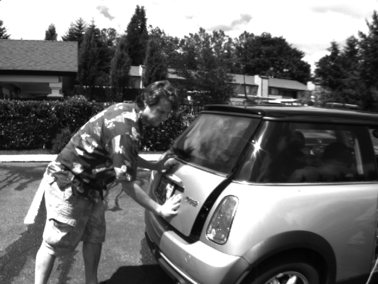
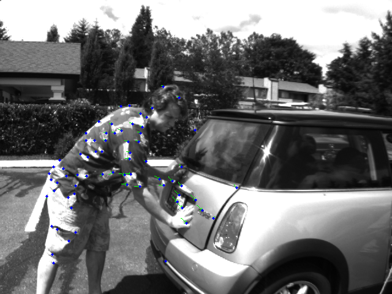
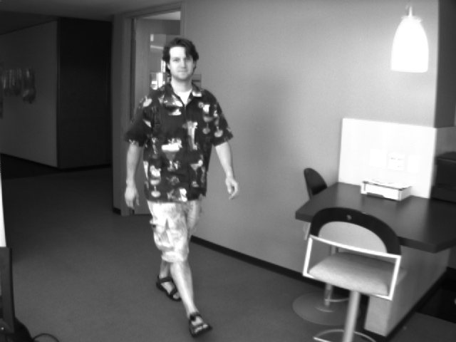
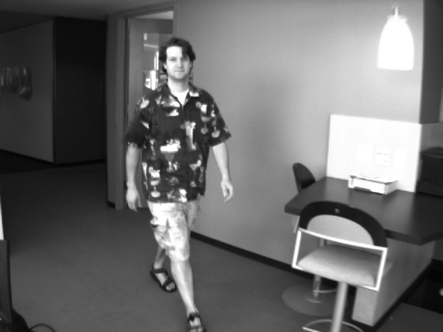
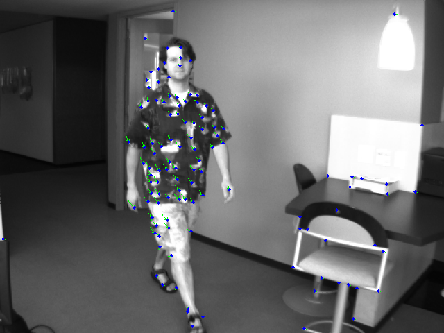
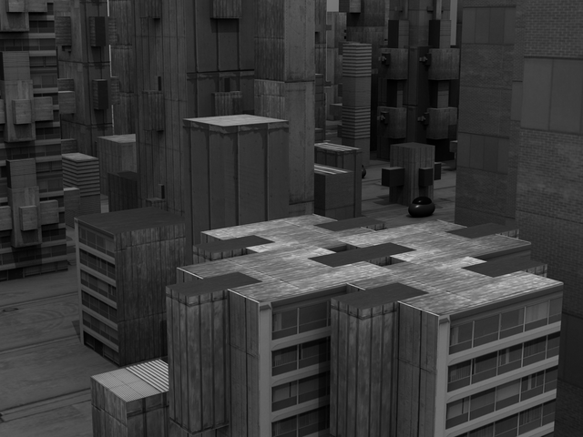
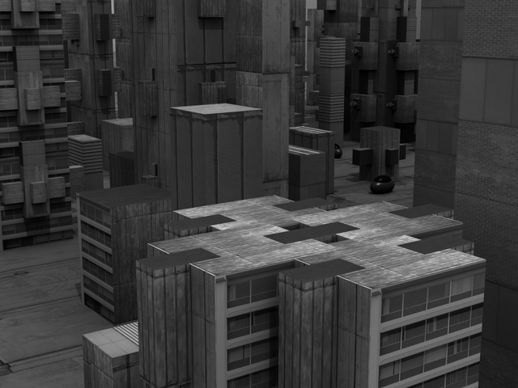
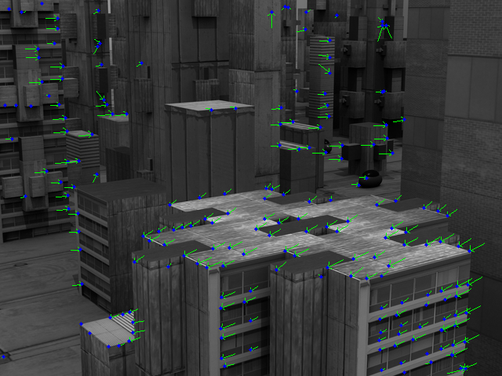

# OpticalFlowPyrLK

## Description
Computes the sparse optical flow between two frames using the pyramidal Lucas-Kanade method.
For every input key-point, the function estimates its displacement between `prev_img` and `next_img`
by iterating a Newton-Raphson solve of the Lucas-Kanade equations over a Gaussian image pyramid,
starting from the coarsest level and refining down to the full resolution image.

You can check the implementation [here](../../../../source/OpticalFlowPyrLK.cpp)

## C++ API
```c++
namespace qlm
{
	template<pixel_t T>
    std::vector<KeyPoint<float>> OpticalFlowPyrLK(
        const Image<ImageFormat::GRAY, T>& prev_img,
        const Image<ImageFormat::GRAY, T>& next_img,
        const std::vector<KeyPoint<float>>& prev_pts,
        const std::vector<KeyPoint<float>>& initial_guess,
        const Size& win_size = Size(21, 21),
        const int max_level = 3,
        const TermCriteria& criteria = TermCriteria(30, 0.01),
        const double min_eig_threshold = 1e-4
    );
}
```

## Parameters

| Name                | Type                       | Description                                                                                                                                         |
|---------------------|----------------------------|-----------------------------------------------------------------------------------------------------------------------------------------------------|
| `prev_img`          | `Image`                    | The first (previous) grayscale frame.                                                                                                                |
| `next_img`          | `Image`                    | The second (next) grayscale frame.                                                                                                                   |
| `prev_pts`          | `std::vector<KeyPoint>`    | Key-points from the previous frame whose flow is estimated. Typically the output of `GoodFeaturesToTrack`.                                            |
| `initial_guess`     | `std::vector<KeyPoint>`    | Initial estimate of the key-points in the next frame. If its size does not match `prev_pts`, the initial flow is assumed zero.                        |
| `win_size`          | `Size`                     | Size of the search window around each key-point.                                                                                                     |
| `max_level`         | `int`                      | Number of pyramid levels used (0 means no pyramid). Larger values allow tracking larger displacements.                                                |
| `criteria`          | `TermCriteria`             | Termination criteria of the iterative refinement: `max_count` iterations and/or `epsilon` (in pixels) on the per-iteration flow update.               |
| `min_eig_threshold` | `double`                   | Minimum accepted eigen value of the 2x2 structure tensor. Key-points below it are marked as `UNTRACKED`. **Note:** the eigen value is computed from unnormalized Sobel gradients averaged over the window, so this threshold is in raw units (e.g. OpenCV's default `1e-4` corresponds to about `1e-4 * 2^20 = 105` here). |

## Return Value
The function returns a vector of key-points of type `std::vector<KeyPoint<float>>` with the same size as
`prev_pts`. Each key-point holds the estimated position in the next frame and a status flag
(`KPStatusFlag::TRACKED` or `KPStatusFlag::UNTRACKED`).

## Example
```c++
#include "shakhbat_cv.hpp"

int main()
{
    std::cout << "start example\n";

    qlm::Timer<qlm::msec> t{};
    std::string frame0 = "frame0.png";
    std::string frame1 = "frame1.png";

    // Load the input images.
    qlm::Image<qlm::ImageFormat::GRAY, uint8_t> prev_img, next_img;
    if (!prev_img.LoadFromFile(frame0))
    {
        std::cout << "Failed to read frame0\n";
        return -1;
    }

    if (!next_img.LoadFromFile(frame1))
    {
        std::cout << "Failed to read frame1\n";
        return -1;
    }

    // Check alpha component.
    bool alpha{ true };
    if (prev_img.NumerOfChannels() == 3)
        alpha = false;

    // ============================================================
    // Detect corners with GoodFeaturesToTrack
    // ============================================================

    const int max_corners = 200;
    const double quality_level = 0.01;
    const double min_distance = 10.0;
    const int blockSize = 3;
    const int gradientSize = 3;
    const bool useHarrisDetector = true;
    const double k = 0.04;

    auto prev_corners = qlm::GoodFeaturesToTrack(
        prev_img,
        max_corners,
        quality_level,
        min_distance,
        blockSize,
        gradientSize,
        useHarrisDetector,
        k
    );

    std::cout << "Found " << prev_corners.size() << " corners\n";

    // ============================================================
    // Lucas-Kanade Optical Flow
    // ============================================================

    const qlm::Size win_size = { 21, 21 };
    const int max_level = 3;
    const qlm::TermCriteria criteria = { 30, 0.01 };
    const double min_eig_threshold = 1e-4;
    std::vector<qlm::KeyPoint<float>> initial_guess;

    t.Start();

    auto next_corners = qlm::OpticalFlowPyrLK(
        prev_img,
        next_img,
        prev_corners,
        initial_guess,
        win_size,
        max_level,
        criteria,
        min_eig_threshold
    );

    t.End();

    std::cout << "Time = " << t.ElapsedString() << "\n";

    // ============================================================
    // Draw optical flow
    //
    // Only key-points with a displacement larger than the flow
    // threshold are drawn.
    // ============================================================

    const float flow_threshold = 1.0f; // px

    qlm::Pixel<qlm::ImageFormat::RGB, uint8_t> green{ 0, 255, 0 };
    qlm::Pixel<qlm::ImageFormat::RGB, uint8_t> red{ 0, 0, 255 };

    auto next_rgb = qlm::ColorConvert<qlm::ImageFormat::GRAY, uint8_t, qlm::ImageFormat::RGB, uint8_t>(next_img);

    for (int i = 0; i < next_corners.size(); i++)
    {
        if (next_corners[i].status == qlm::KPStatusFlag::TRACKED)
        {
            const qlm::Point<float> displacement = next_corners[i].point - prev_corners[i].point;

            // keep only key-points with meaningful motion
            if (displacement.x * displacement.x + displacement.y * displacement.y < flow_threshold * flow_threshold)
            {
                continue;
            }

            const qlm::Line l =
            {
                int(prev_corners[i].point.x),
                int(prev_corners[i].point.y),
                int(next_corners[i].point.x),
                int(next_corners[i].point.y)
            };

            // Green arrow from previous point to tracked point.
            next_rgb = qlm::DrawArrowedLine(next_rgb, l, green, 0.3);

            // Red filled dot at tracked point.
            qlm::Circle<int> endpoint
            {
                .center =
                {
                    int(next_corners[i].point.x),
                    int(next_corners[i].point.y)
                },
                .radius = 2
            };

            next_rgb = qlm::DrawCircle(next_rgb, endpoint, red, -1);
        }
    }

    // ============================================================
    // Save result image
    // ============================================================

    if (!next_rgb.SaveToFile("result.png", alpha))
    {
        std::cout << "Failed to write result.png\n";
    }
    else
    {
        std::cout << "Saved result.png\n";
    }
}
```

## Example 1
### The parameters
| Parameter           | Value                            |
|---------------------|----------------------------------|
| `win_size`          | 21 x 21                          |
| `max_level`         | 3                                |
| `criteria`          | max_count = 30, epsilon = 0.01   |
| `min_eig_threshold` | 1e-4 (raw units)                 |
| `initial_guess`     | empty (zero initial flow)        |

### The input


### The output


Time =  186914 msec

### The parameters
| Parameter           | Value                                              |
|---------------------|----------------------------------------------------|
| `win_size`          | 11 x 11                                            |
| `max_level`         | 5                                                  |
| `criteria`          | max_count = 10, epsilon = 0.1                      |
| `min_eig_threshold` | 1e-4 * 2^20 = 104.86 (raw units, gate active)      |
| `initial_guess`     | empty (zero initial flow)                          |

## Example 2
### The input


### The output


Time = 34469 msec

## Example 3
### The parameters
| Parameter           | Value                                              |
|---------------------|----------------------------------------------------|
| `win_size`          | 15 x 15                                            |
| `max_level`         | 2                                                  |
| `criteria`          | max_count = 20, epsilon = 0.001                    |
| `min_eig_threshold` | 1e-4 (raw units)                                   |
| `initial_guess`     | empty (zero initial flow)                          |

### The input


### The output


Time = 273339 msec
