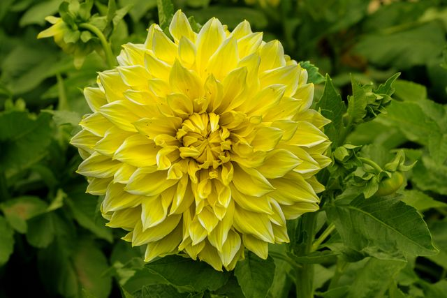
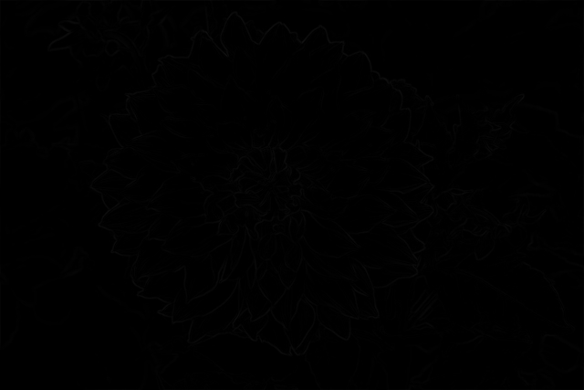
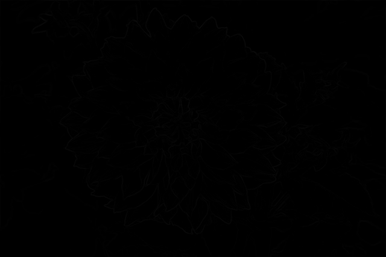

# Magnitude

## Description
Computes the per-pixel gradient magnitude of two derivative images:

- `L2gradient = true`: `sqrt(gx^2 + gy^2)` (L2 norm)
- `L2gradient = false`: `|gx| + |gy|` (L1 norm)

The result saturates at the output range. The output pixel type is the unsigned counterpart of the input type (e.g., `int16_t -> uint16_t`).

You can check the implementation [here](../../../../source/Magnitude.cpp)

## C++ API
```c++
namespace qlm
{
	template<pixel_t T>
	Image<ImageFormat::GRAY, std::make_unsigned_t<T>> Magnitude(
		const Image<ImageFormat::GRAY, T>& g_x,
		const Image<ImageFormat::GRAY, T>& g_y,
		const bool L2gradient = false);
}
```

## Parameters

| Name         | Type   | Description                                                       |
|--------------|--------|-------------------------------------------------------------------|
| `g_x`        | `Image`| The x derivative image (GRAY).                                    |
| `g_y`        | `Image`| The y derivative image (GRAY).                                    |
| `L2gradient` | `bool` | `true` for the L2 norm, `false` for the L1 norm. Default `false`. |

## Return Value
The function returns an image of type `Image<GRAY, make_unsigned_t<T>>`.

Note: currently only `int16_t -> uint16_t` is instantiated.

## Example

```c++
    qlm::Timer<qlm::msec> t{};
    std::string file_name = "input.jpg";
    // load the image
    qlm::Image<qlm::ImageFormat::RGB, uint8_t> in;
    if (!in.LoadFromFile(file_name))
    {
        std::cout << "Failed to read the image\n";
        return -1;
    }
    auto gray = qlm::ColorConvert<qlm::ImageFormat::RGB, uint8_t, qlm::ImageFormat::GRAY, uint8_t>(in);

    auto gx = qlm::ScharrX<uint8_t, int16_t>(gray);
    auto gy = qlm::ScharrY<uint8_t, int16_t>(gray);

    t.Start();
    auto mag = qlm::Magnitude(gx, gy, true);
    t.End();

    std::cout <<"Time = " << t.ElapsedString() << "\n";

    mag.SaveToFile("result.jpg");
```

### The input


### Result L1


Time = 0.6 ms

### Result L2


Time = 0.5 ms