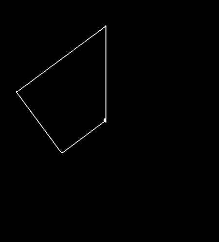
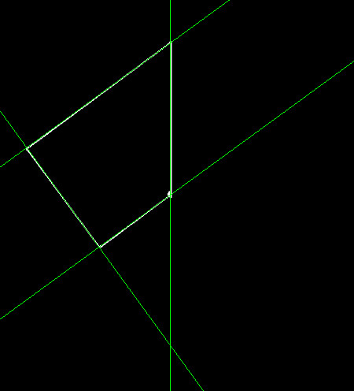

# Hough Lines

## Description
Finds lines in a binary image using the standard Hough transform
## C++ API
```c++
namespace qlm
{
	void HoughLines(
		const sf::Image& in, 
			  std::vector<LinesPolar>& lines, 
			  float  rho, 
			  float theta_step,
			  int threshold, 
			  double min_theta = 0, 
			  double max_theta = std::numbers::pi
		);
}
```
```c++
namespace qlm
{
	struct LinesPolar
	{
		int radius;
		int angle;
	};
}
```
## Parameters

| Name        | Type         | Description                                                                                  |
|-------------|--------------|----------------------------------------------------------------------------------------------|
| `in`        | `sf::Image`  | The input image.                                                                             |
| `lines`     | `LinesPolar` | The output detected lines in polar form.                                                     |
| `rho`       | `float`      | The Distance resolution of the accumulator in pixels.                                        |
| `theta`     | `float`      | The angle resolution of the accumulator in radians.                                          |
| `threshold` | `int`        | The threshold parameter. Only those lines are returned that get enough votes ( >threshold ). |
| `min_theta` | `double`     | The minimum angle to check for lines. Must fall between 0 and max_theta.                     |
| `max_theta` | `double`     | The upper bound for the angle. Must fall between min_theta and PI.                         |

## Result  for these parameters 
	rho = 1
	theta = 3 * PI / 180
	threshold = 110
	min_theta = 0
	double max_theta = PI
### The input

### The output


Time = 32 ms

