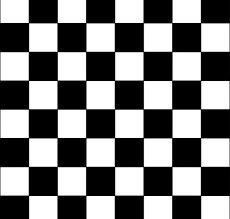
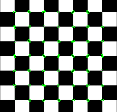

# Harris Corner

## Description
Harris corner detector
## C++ API
```c++
namespace qlm
{
	template<ImageFormat frmt, pixel_t T = uint8_t>
	std::vector<KeyPoint<int>> HarrisCorner(
		const Image<frmt, T>& in,
		const unsigned int block_size,
		const unsigned int filter_size,
		float k,
		float threshold,
		const Border border_type = Border::BORDER_CONSTANT,
		const int border_value = 0
	)
}
```
```c++
namespace qlm
{
	struct KeyPoint 
	{
		Point<T> point;
		float size;
		float angle;
		float response;
		int octave;
		int class_id;
	}
}
```
## Parameters

| Name          | Type          | Description                                                                                  |
|---------------|---------------|----------------------------------------------------------------------------------------------|
| `in`          | `Image`       | The input image.                                                                             |
| `block_size`  | `unsigned int`| The neighborhood size.                                                                       |
| `filter_size` | `unsigned int`| The aperture parameter for the Sobel operator.                                               |
| `k`           | `float`       | Harris detector free parameter.															   |
| `threshold`   | `float`       | The threshold parameter. Only those corners are returned that have response ( >threshold ).  |
| `border_type` | `BORDER`      | The pixel extrapolation method.															   |
| `border_value`| `int`         | The value to be used if the border is BORDER::BORDER_CONSTANT.                               |

## Example 
	unsigned int filter_size = 3;
	unsigned int block_size = 3;
	float k = 0.22;
	float threshold = 9900000;

```c++
    qlm::Timer<qlm::msec> t{};
	std::string file_name = "images.png";
	// load the image
	qlm::Image<qlm::ImageFormat::RGB, uint8_t> in;
	if (!in.LoadFromFile(file_name))
	{
		std::cout << "Failed to read the image\n";
		return -1;
	}
	// check alpha component
	bool alpha{ true };
	if (in.NumerOfChannels() == 3)
		alpha = false;

	unsigned int filter_size = 3;
	unsigned int block_size = 3;
	float k = 0.22;
	float threshold = 9900000;
	
	// do the operation
	t.start();
	auto out = qlm::HarrisCorner(in, block_size, filter_size, k, threshold);
	t.end();

	t.show();

	qlm::Circle<int> circle = { .radius = 2 };
	qlm::Pixel <qlm::ImageFormat::RGB, uint8_t> green{ 0, 255, 0};
	qlm::Image<qlm::ImageFormat::RGB, uint8_t> draw = in;

	for (auto& i : out)
	{
		circle.center = i.point;
		draw = qlm::DrawCircle(draw, circle, green);
	}

	
	if (!in.SaveToFile("result.jpg", alpha))
	{
		std::cout << "Falied to write \n";
	}
```

### The input

### The output


Time = 11 ms

