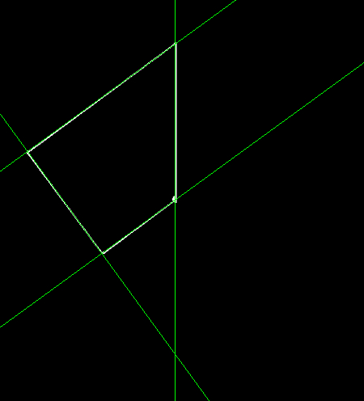

# Hough Lines

## Description
Finds lines in a binary image using the standard Hough transform
## C++ API
```c++
namespace qlm
{
	template<ImageFormat frmt, pixel_t T>
	std::vector<LinePolar> HoughLines(const Image<frmt, T>& in,
									  float  rho, 
									  float theta_step, 
									  int threshold,
									  double min_theta = 0,
									  double max_theta = std::numbers::pi);
}
```
```c++
namespace qlm
{
	struct LinesPolar
	{
		int radius;
		int angle;
	};
}
```
## Parameters

| Name        | Type         | Description                                                                                  |
|-------------|--------------|----------------------------------------------------------------------------------------------|
| `in`        | `Image`      | The input image.                                                                             |
| `rho`       | `float`      | The Distance resolution of the accumulator in pixels.                                        |
| `theta`     | `float`      | The angle resolution of the accumulator in radians.                                          |
| `threshold` | `int`        | The threshold parameter. Only those lines are returned that get enough votes ( >threshold ). |
| `min_theta` | `double`     | The minimum angle to check for lines. Must fall between 0 and max_theta.                     |
| `max_theta` | `double`     | The upper bound for the angle. Must fall between min_theta and PI.                         |

## Example 
	rho = 1
	theta = 3 * PI / 180
	threshold = 110
	min_theta = 0
	double max_theta = PI

```c++
    qlm::Timer<qlm::msec> t{};
	std::string file_name = "input.png";
	// load the image
	qlm::Image<qlm::ImageFormat::GRAY, uint8_t> in;
	if (!in.LoadFromFile(file_name))
	{
		std::cout << "Failed to read the image\n";
		return -1;
	}
	// check alpha component
	bool alpha{ true };
	if (in.NumerOfChannels() == 1)
		alpha = false;
	// do the operation
	t.start();
	std::vector<qlm::LinePolar> lines = qlm::HoughLines(in, 1, 3 * 3.14f / 180, 110);
	t.end();

	t.show();

	// out image to draw on
	qlm::Image<qlm::ImageFormat::RGB, uint8_t> out;
	out.create(in.Width(), in.Height(), qlm::Pixel<qlm::ImageFormat::RGB, uint8_t>{ 0, 0, 0 });
	// copy GRAY to RGB (for now until color convert implemented)
	for (int y = 0; y < in.Height(); y++)
	{
		for (int x = 0; x < in.Width(); x++)
		{
			qlm::Pixel<qlm::ImageFormat::GRAY, uint8_t> pix = in.GetPixel(x, y);
			qlm::Pixel<qlm::ImageFormat::RGB, uint8_t> pix_out;
			pix_out.Set(pix.v, pix.a);
			out.SetPixel(x, y, pix_out);
		}
	}
	

	std::cout << "number of lines : " << lines.size() << "\n";
	for (auto& line : lines)
	{
		std::cout << "r: " << line.radius << "  theta: " << line.angle << "\n";
		qlm::DrawLine(out, line, qlm::Pixel<qlm::ImageFormat::RGB, uint8_t>{ 0,255,0 });
	}
	
	if (!out.SaveToFile("result.jpg", alpha))
	{
		std::cout << "Falied to write \n";
	}
```

### The input

### The output


Time = 2 ms

