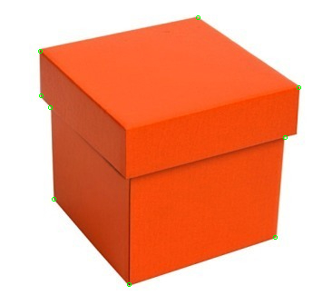

# FAST Example


```c++
    qlm::Timer<qlm::msec> t{};
    std::string file_name = "input.jpg";
    // load the image
    qlm::Image<qlm::ImageFormat::RGB, uint8_t> in;
    if (!in.LoadFromFile(file_name))
    {
        std::cout << "Failed to read the image\n";
        return -1;
    }

    // check alpha component
    bool alpha{ true };
    if (in.NumerOfChannels() == 3)
        alpha = false;

    auto gray = qlm::ColorConvert< qlm::ImageFormat::RGB, uint8_t, qlm::ImageFormat::GRAY, uint8_t>(in);

    const uint8_t threshold = 70;
    const int arc_len = 9;
    const bool nonmax_suppression = true;

    // do the operation
    t.start();
    auto out = qlm::FAST(gray, arc_len, threshold, nonmax_suppression);
    t.end();

    t.show();

    // draw corners
    qlm::Circle<int> circle = { .radius = 2 };
    qlm::Pixel <qlm::ImageFormat::RGB, uint8_t> green{ 0, 255, 0 };


    for (auto& i : out)
    {
        circle.center = i.point;
        in = qlm::DrawCircle(in, circle, green);
    }


    if (!in.SaveToFile("result.jpg", alpha))
    {
        std::cout << "Failed to write \n";
    }
   
```

### The input

### The output


Time = 1 ms

