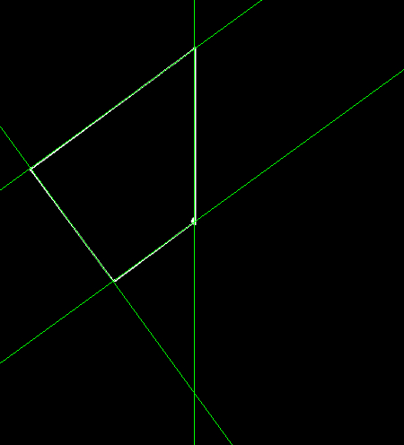

# Hough Lines Example


```c++
    qlm::Timer<qlm::msec> t{};
	std::string file_name = "input.png";
	// load the image
	qlm::Image<qlm::ImageFormat::GRAY, uint8_t> in;
	if (!in.LoadFromFile(file_name))
	{
		std::cout << "Failed to read the image\n";
		return -1;
	}
	// check alpha component
	bool alpha{ true };
	if (in.NumerOfChannels() == 1)
		alpha = false;
	// do the operation
	t.start();
	std::vector<qlm::LinePolar> lines = qlm::HoughLines(in, 1, 3 * 3.14f / 180, 110);
	t.end();

	t.show();

	// out image to draw on
	auto draw = qlm::ColorConvert< qlm::ImageFormat::GRAY, uint8_t, qlm::ImageFormat::RGB, uint8_t>(in);

	for (auto& line : lines)
	{
		draw = qlm::DrawLine(draw, line, qlm::Pixel<qlm::ImageFormat::RGB, uint8_t>{ 0, 255, 0 });
	}

	if (!draw.SaveToFile("result.jpg", alpha))
	{
		std::cout << "Falied to write \n";
	}

```

### The input

### The output


Time = 2 ms

