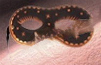

# Match Template Example


```c++
    qlm::Timer<qlm::msec> t{};
    std::string file_name = "input.jpg";
    // load the input image
    qlm::Image<qlm::ImageFormat::RGB, uint8_t> in;
    if (!in.LoadFromFile(file_name))
    {
        std::cout << "Failed to read the input image\n";
        return -1;
    }

    // check alpha component
        bool alpha{ true };
        if (in.NumerOfChannels() == 1)
            alpha = false;

    std::string template_name = "template.jpg";
    // load the template image
    qlm::Image<qlm::ImageFormat::RGB, uint8_t> templ;
    if (!templ.LoadFromFile(template_name))
    {
        std::cout << "Failed to read the template image\n";
        return -1;
    }

    qlm::Image<qlm::ImageFormat::GRAY, uint8_t> mask{};
    mask.create(templ.Width(), templ.Height(), 1);

    t.start();
    auto out = qlm::MatchTemplate(in, templ, qlm::TemplateMatchFlag::SQDIFF, mask);
    t.end();

    t.show();

    // find min/max locations
    auto [min_loc, max_loc] = qlm::MinMaxLoc(out);

    qlm::Pixel <qlm::ImageFormat::RGB, uint8_t> green{ 0, 255, 0 };
    qlm::Rectangle rec{ {0, 0}, templ.Width(), templ.Height() };

    for (auto &p : min_loc)
    {
        rec.top_left = p;
        in = qlm::DrawRectangle(in, rec, green);
    }

    if (!in.SaveToFile("result.jpg", alpha))
    {
        std::cout << "Failed to write \n";
    }
```

### The input

### The template

### The output


Time = 215240 ms

