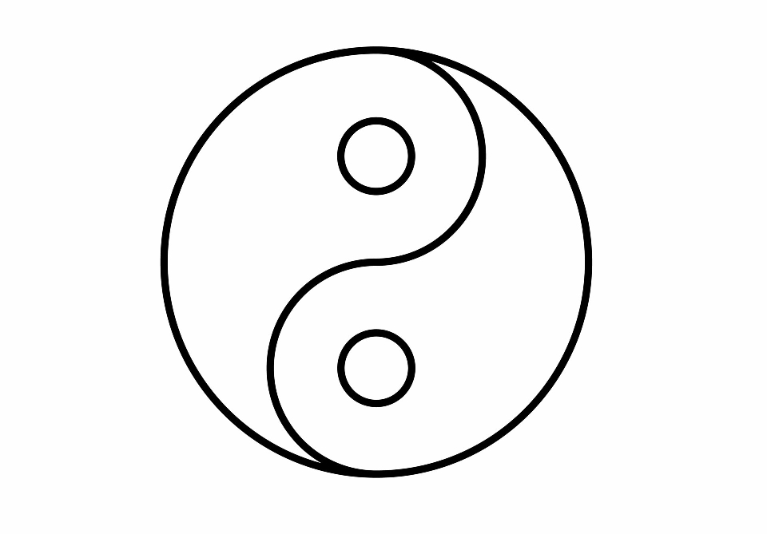

# Flood Fill Example


```c++
	qlm::Timer<qlm::msec> t{};
	std::string file_name = "input.jpg";
	// load the image
	qlm::Image<qlm::ImageFormat::RGB, uint8_t> in;
	if (!in.LoadFromFile(file_name))
	{
		std::cout << "Failed to read the image\n";
		return -1;
	}
	// check alpha component
	bool alpha{ true };
	if (in.NumerOfChannels() == 3)
		alpha = false;

	qlm::Point seed{ 300 ,300 };
	qlm::Pixel<qlm::ImageFormat::RGB, uint8_t> color{0,0,0};
	qlm::Pixel<qlm::ImageFormat::RGB, uint8_t> threshold{ 20,20,20 };
	// do the operation
	t.start();
	auto out = qlm::FloodFill(in, seed, color, threshold);
	t.end();

	t.show();


	if (!out.SaveToFile("result.jpg", alpha))
	{
		std::cout << "Falied to write \n";
	}
```
### The input

### The output


Time = 5 ms

