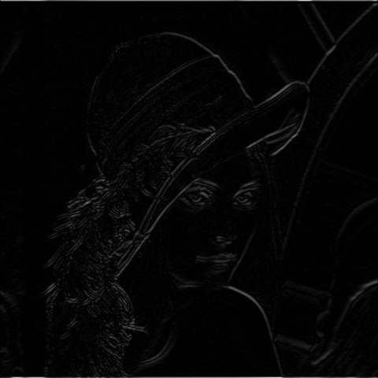
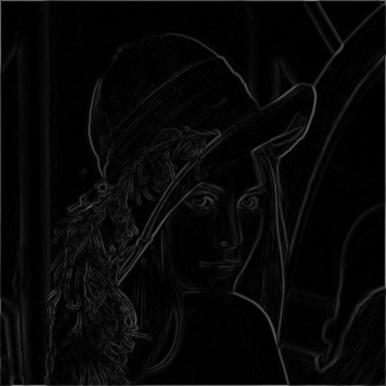

# Sobel Example

```c++
    qlm::Timer<qlm::msec> t{};
	std::string file_name = "input.jpg";
	// load the image
	qlm::Image<qlm::ImageFormat::RGB, uint8_t> in;
	if (!in.LoadFromFile(file_name))
	{
		std::cout << "Failed to read the image\n";
		return -1;
	}
	// check alpha component
	bool alpha{ true };
	if (in.NumerOfChannels() == 3)
		alpha = false;

	unsigned int filter_size = 3;
	// RGB to GRAY
	auto gray = qlm::ColorConvert<qlm::ImageFormat::RGB, uint8_t, qlm::ImageFormat::GRAY, uint8_t>(in);
	// do the operation
	t.start();
	auto out = qlm::Sobel<uint8_t, int16_t>(gray, filter_size);
	t.end();

	t.show();

	// S16 to U8
	auto x = qlm::ConvertSobelDepth(out.sobel_x, filter_size);
	auto y = qlm::ConvertSobelDepth(out.sobel_y, filter_size);

	if (!x.SaveToFile("resultx.jpg", alpha))
	{
		std::cout << "Falied to write \n";
	}

	if (!y.SaveToFile("resulty.jpg", alpha))
	{
		std::cout << "Falied to write \n";
	}

	if (!out.magnitude.SaveToFile("result.jpg", alpha))
	{
		std::cout << "Falied to write \n";
	}
```

### The input

### The output X

### The output Y

### The output


Time = 30 ms

