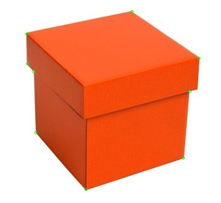

# FAST

## Description
Detects corners using the FAST algorithm

You can check the implementation [here](../../../../source/FAST.cpp)

## C++ API
```c++
namespace qlm
{
	template<pixel_t T>
	std::vector<KeyPoint<int>> FAST(
		const Image<ImageFormat::GRAY, T>& in,
		const unsigned int arc_length = 9,
		const T threshold = 10,
		const bool non_max_suppression = true);
}
```

## Parameters

| Name                  | Type          | Description                                                                                               |
|-----------------------|---------------|-----------------------------------------------------------------------------------------------------------|
| `in`                  | `Image`       | The input image.                                                                                          |
| `arc_length`          | `unsigned int`| Arc length in pixels over the circle to check central pixel is a corner.                                  |
| `threshold`           | `pixel_t`     | threshold on difference between intensity of the central pixel and pixels of a circle around this pixel.  |
| `non_max_suppression` | `bool`        | if true, non-maximum suppression is applied to detected corners										    |


## Return Value
The function returns a vector of key-points(corners) of type `std::vector<KeyPoint<int>>`.

## Example
 
```c++
    qlm::Timer<qlm::msec> t{};
    std::string file_name = "input.jpg";
    // load the image
    qlm::Image<qlm::ImageFormat::RGB, uint8_t> in;
    if (!in.LoadFromFile(file_name))
    {
        std::cout << "Failed to read the image\n";
        return -1;
    }

    // check alpha component
    bool alpha{ true };
    if (in.NumerOfChannels() == 3)
        alpha = false;

    auto gray = qlm::ColorConvert< qlm::ImageFormat::RGB, uint8_t, qlm::ImageFormat::GRAY, uint8_t>(in);

    const uint8_t threshold = 70;
    const int arc_len = 9;
    const bool nonmax_suppression = true;

    // do the operation
    t.start();
    auto out = qlm::FAST(gray, arc_len, threshold, nonmax_suppression);
    t.end();

    t.show();

    // draw corners
    qlm::Circle<int> circle = { .radius = 2 };
    qlm::Pixel <qlm::ImageFormat::RGB, uint8_t> green{ 0, 255, 0 };


    for (auto& i : out)
    {
        circle.center = i.point;
        in = qlm::DrawCircle(in, circle, green);
    }


    if (!in.SaveToFile("result.jpg", alpha))
    {
        std::cout << "Failed to write \n";
    }
   
```

### The input

### The output


Time = 1 ms
