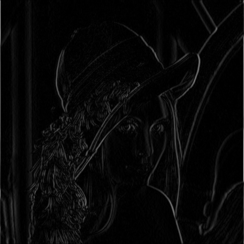
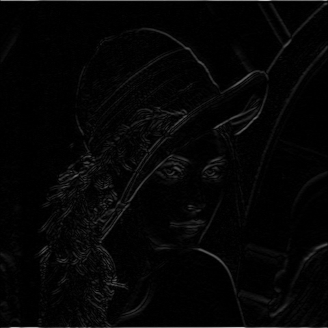

# Sobel

## Description
Apples sobel filter of size NxN on the input image.

You can check the implementation [here](../../../../source/Sobel.cpp)

## C++ API

### `SobelX` Function
 Performs Sobel X derivative on the input image. input image must be in GRAY format

```c++
	template<pixel_t in_t, pixel_t out_t = int16_t>
	Image<ImageFormat::GRAY, out_t> SobelX(
		const Image <ImageFormat::GRAY, in_t>& in,
		const unsigned int kernel_size,
		const BorderMode<ImageFormat::GRAY, in_t>& border_mode = BorderMode<ImageFormat::GRAY, in_t>{}
	);
```
### Parameters

| Name           | Type           | Description                                                                                  |
|----------------|----------------|----------------------------------------------------------------------------------------------|
| `in_t`         | `pixel_t`      | The data type of the input image.                                                            |
| `out_t`        | `pixel_t`      | The data type of the output image.                                                           |
| `in`           | `Image`        | The input image<GRAY, in_t>.                                                                 |
| `kernel_size`  | `unsigned int` | The kernel size to be used on the input image.                                               |
| `border_mode`  | `BorderMode` | The pixel extrapolation method.                                                              |

### Return Value
The function returns an image of type `Image<ImageFormat::GRAY, out_t>`.

### `SobelY` Function
 Performs Sobel Y derivative on the input image. input image must be in GRAY format

```c++
	template<pixel_t in_t, pixel_t out_t = int16_t>
	Image<ImageFormat::GRAY, out_t> SobelY(
		const Image<ImageFormat::GRAY, in_t>& in,
		const unsigned int kernel_size,
		const BorderMode<ImageFormat::GRAY, in_t>& border_mode = BorderMode<ImageFormat::GRAY, in_t>{}
	);
```
### Parameters

| Name           | Type           | Description                                                                                  |
|----------------|----------------|----------------------------------------------------------------------------------------------|
| `in_t`         | `pixel_t`      | The data type of the input image.                                                            |
| `out_t`        | `pixel_t`      | The data type of the output image.                                                           |
| `in`           | `Image`        | The input image<GRAY, in_t>.                                                                 |
| `kernel_size`  | `unsigned int` | The kernel size to be used on the input image.                                               |
| `border_mode`  | `BorderMode` | The pixel extrapolation method.                                                              |

### Return Value
The function returns an image of type `<ImageFormat::GRAY, out_t>`.

### `Sobel` Function
 Performs Sobel derivative on the input image. input image must be in GRAY format
 The return data type is `SobelDerivatives`

```c++
   template<pixel_t in_t, pixel_t out_t = int16_t>
	SobelDerivatives<in_t, out_t> Sobel(
		const Image<ImageFormat::GRAY, in_t>& in,
		const unsigned int kernel_size,
		const BorderMode<ImageFormat::GRAY, in_t>& border_mode = BorderMode<ImageFormat::GRAY, in_t>{}
	);
```
### Parameters

| Name           | Type           | Description                                                                                  |
|----------------|----------------|----------------------------------------------------------------------------------------------|
| `in_t`         | `pixel_t`      | The data type of the input image.                                                            |
| `out_t`        | `pixel_t`      | The data type of the output image.                                                           |
| `in`           | `Image`        | The input image<GRAY, in_t>.                                                                 |
| `kernel_size`  | `unsigned int` | The kernel size to be used on the input image.                                               |
| `border_mode`  | `BorderMode`   | The pixel extrapolation method.                                                              |

### Return Value
The function returns an structure of type `SobelDerivatives<in_t, out_t>`.


### `ConvertSobelDepth` Function
 Change Bit Depth of sobel from S16 to U8

```c++
  Image<ImageFormat::GRAY, uint8_t> ConvertSobelDepth(Image < ImageFormat::GRAY, int16_t>& in,
														unsigned int filter_size);
```
### Parameters

| Name           | Type           | Description                                 |
|----------------|----------------|---------------------------------------------| 
| `in`           | `Image`        | The input image<GRAY, uint8_t>.             |
| `filter_size`  | `unsigned int` | The filter size used for the image.         |

### Return Value
The function returns an image of type `Image<ImageFormat::GRAY, uint8_t>`.


## Example

```c++
    qlm::Timer<qlm::msec> t{};
	std::string file_name = "input.jpg";
	// load the image
	qlm::Image<qlm::ImageFormat::RGB, uint8_t> in;
	if (!in.LoadFromFile(file_name))
	{
		std::cout << "Failed to read the image\n";
		return -1;
	}
	// check alpha component
	bool alpha{ true };
	if (in.NumerOfChannels() == 3)
		alpha = false;

	unsigned int filter_size = 3;
	// RGB to GRAY
	auto gray = qlm::ColorConvert<qlm::ImageFormat::RGB, uint8_t, qlm::ImageFormat::GRAY, uint8_t>(in);
	// do the operation
	t.start();
	auto out = qlm::Sobel<uint8_t, int16_t>(gray, filter_size);
	t.end();

	t.show();

	// S16 to U8
	auto x = qlm::ConvertSobelDepth(out.sobel_x, filter_size);
	auto y = qlm::ConvertSobelDepth(out.sobel_y, filter_size);

	if (!x.SaveToFile("resultx.jpg", alpha))
	{
		std::cout << "Failed to write \n";
	}

	if (!y.SaveToFile("resulty.jpg", alpha))
	{
		std::cout << "Failed to write \n";
	}

	if (!out.magnitude.SaveToFile("result.jpg", alpha))
	{
		std::cout << "Failed to write \n";
	}
```

### The input

### The output X

### The output Y

### The output


Time = 30 ms