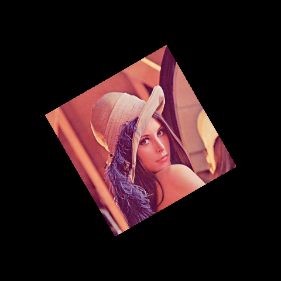

# Wrap Affine

## Description
Applies an affine transformation to an image.

The function WarpAffine transforms the input image using 2x3 transformation matrix:

You can check the implementation [here](../../../../source/WarpAffine/WarpAffine.cpp)

## C++ API
```c++
namespace qlm
{
	template<ImageFormat frmt, pixel_t T>
	Image<frmt, T> WarpAffine(
		const Image<frmt, T>& in,
		const AffineMatrix& mat,
		const int dst_width,
		const int dst_height,
		const InterpolationFlag inter,
		const BorderMode<frmt, T>& border_mode = BorderMode<frmt, T>{});
}
```

## Parameters

| Name         | Type                  | Description                      |
|--------------|-----------------------|----------------------------------|
| `in`         | `Image`               | The input image.                 |
| `mat`        | `AffineMatrix`        | 2�3 transformation matrix.       |
| `dst_width`  | `int`                 | Output image width.              |
| `dst_height` | `int`                 | Output image height.             |
| `inter`      | `InterpolationFlag`   | The interpolation method.        |
| `border_mode`| `BorderMode`          | The pixel extrapolation method.  |

## Return Value
The function returns an image of type `Image<frmt, T>`.

## Example

```c++
	qlm::Timer<qlm::msec> t{};
	std::string file_name = "input.jpg";
	// load the image
	qlm::Image<qlm::ImageFormat::RGB, uint8_t> in;
	if (!in.LoadFromFile(file_name))
	{
		std::cout << "Failed to read the image\n";
		return -1;
	}
	// check alpha component
	bool alpha{ true };
	if (in.NumerOfChannels() == 3)
		alpha = false;


	float scale = 0.5f;
	float angle = 30.0f;
	const int dst_width = in.width;
	const int dst_height = in.height;

	const qlm::Point<int> center{ (int)in.width / 2, (int)in.height / 2 };

	qlm::AffineMatrix mat = qlm::GetRotationMatrix(center, angle, scale);

	auto border_mode = qlm::BorderMode<qlm::ImageFormat::RGB, uint8_t>{};
	border_mode.border_type = qlm::BorderType::BORDER_REFLECT;
	
	// do the operation
	t.start();
	auto out = qlm::WarpAffine(in, mat, dst_width, dst_height, qlm::InterpolationFlag::BILINEAR, border_mode);
	t.end();

	t.show();

	if (!out.SaveToFile("result.jpg", alpha))
	{
		std::cout << "Failed to write \n";
	}
```
### The input

### The output


Time = 3 ms
